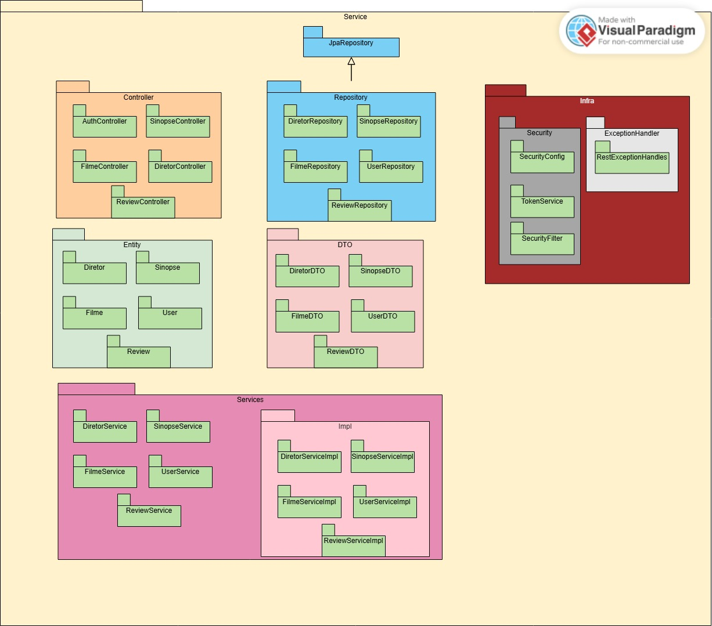

[](https://my-movie-list.us.kg)

       

**Considere dar uma estrela ⭐ e compartilhar o nosso projeto!**

[](https://www.linkedin.com/sharing/share-offsite/?url=https://github.com/pedro21Ribeiro/trabalhoFinalPOO) [](https://www.reddit.com/submit?title=Confira%20essse%20projeto%20no%20github%20https://github.com/pedro21Ribeiro/trabalhoFinalPOO)

# Índice

[**my-movie-list.us.kg**](https://my-movie-list.us.kg)

- [Sobre](https://github.com/pedro21Ribeiro/trabalhoFinalPOO#Sobre)
- [Documentação](https://github.com/pedro21Ribeiro/trabalhoFinalPOO#Documentação)
- [Instalar localmente](https://github.com/pedro21Ribeiro/trabalhoFinalPOO#Instalar-localmente)
- [Créditos](https://github.com/pedro21Ribeiro/trabalhoFinalPOO#Créditos)

# Sobre

A **API MyMovieList** foi desenvolvida como parte de um projeto acadêmico na **Fatec Mogi Mirim**, com foco em oferecer uma solução prática e eficiente para consulta de filmes, diretores e sinopses.

Construída com **Spring Boot**, a API aplica boas práticas de desenvolvimento e segurança, como:

- Autenticação **JWT**;
- Versionamento de código;
- Suporte a contêineres;
- Hospedagem em nuvem.

Nosso objetivo é combinar **tecnologia moderna** com **simplicidade** para entregar uma experiência funcional e bem estruturada.

# Documentação

A documentação da API foi feita em Swagger e está disponível de forma online [nesse link](https://my-movie-list.us.kg/swagger-ui/index.html).

Adicionalmente temos o seguinte diagrama de pacotes para facilitar o entendimento da aplicação.



# Instalar localmente

A API está disponível ao público a partir da url [my-movie-list.us.kg](https://my-movie-list.us.kg/) porém a aplicação da API está disponível também abertamente no Dockerhub, portanto é possível instalar localmente a API para retirar a latencia entre a nossa API e o banco de dados.

1. Instale Docker usando o passo a passo oficial
    - [Windows](https://docs.docker.com/desktop/setup/install/windows-install/)
    - [Mac](https://docs.docker.com/desktop/setup/install/mac-install/)
    - [Linux](https://docs.docker.com/desktop/setup/install/linux/)
2. Com o Docker instalado e funcionando siga o passo a passo abaixo:

```bash
#Abra algum terminal qualquer como bash
#powershell, cmd, fish ...

#Verifique que Docker está instalado e funcionando
docker version

#Baixa a imagem mais atualizada
docker pull peterpedro01/mymovielist:1.1.0

#Crie um contaier para rodar a imagem
#Obs:Altere isso  V  para trocar a porta de 80 para uma de sua escolha
docker run -d -p 80:8080 --name MyMovieList peterpedro01/mymovielist:1.1.0

#Aguarde algum tempo e verifique que está funcional a aplicação
docker logs MyMovieList
```

# Créditos

Trabalho realizado por:

- Eder Pedro Venâncio
- Mariane Oliveira dos Santos
- Moisés de Oliveira Sampaio
- Pedro Silva Ribeiro
